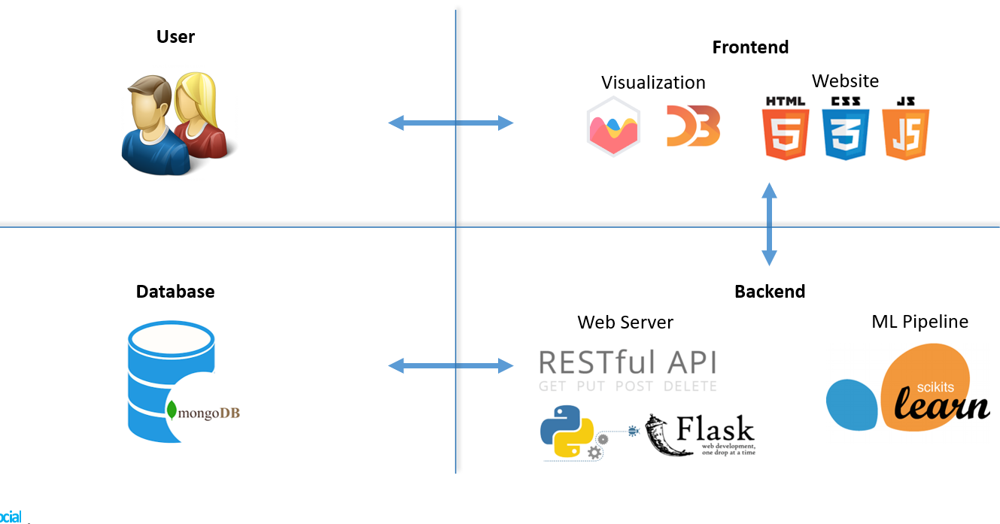
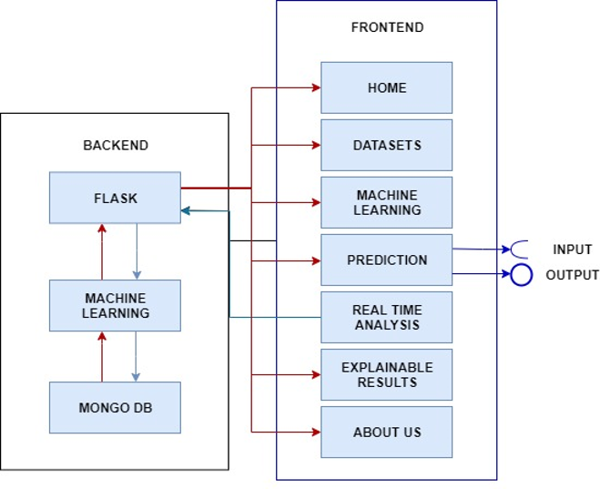
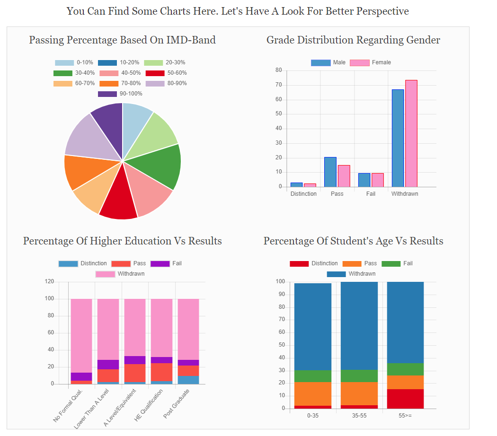
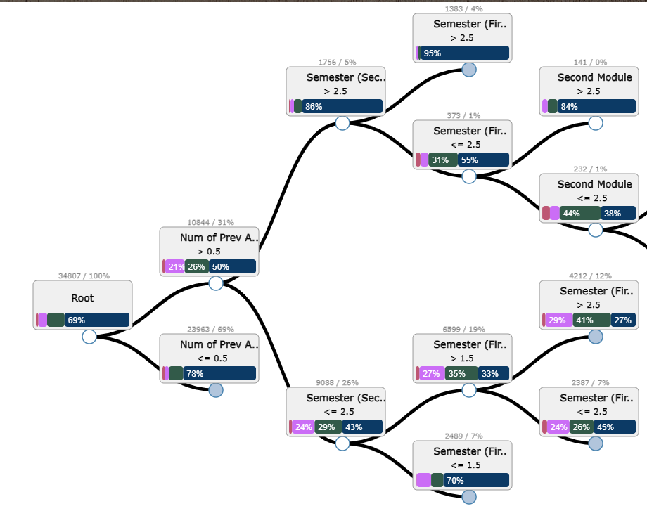

# Table of content 
- [OULA (intelligent grade prediction system)](#headers)
- [Dataset Description](#headers1)
- [Implementation Technologies](#headers2)
- [App Structure](#headers3)
- [Code Description](#headers4)
- [To deploy the project](#headers5)
- [Contributors](#headers5)

<a name="headers"/>


<br>
<br>
<a href="https://www.youtube.com/watch?v=5uQ82EeYmuo">A Youtube video shows a demo</a>


# OULA
Open University Learning Analytics its an intelligent grade prediction system that aims to analyse student performance and predict their results [Distinction, Fail, Pass, Withdrawn]. 

This project was submited as a final project for <a href="https://www.uni-due.de/soco/teaching/overview.php">Learning Analitics course</a> under <a href="https://www.uni-due.de/soco/">Social Computing department</a> at <a href="https://www.uni-due.de/en/index.php">Duisburg-Essen University</a>.


<a name="headers1"/>

# Dataset Description
* Multivariate dataset
* It consists of 7 tables in csv format
* Categorized based on 3 main types :
  + Demographic - Gender, Age, Region, IMD-band, Highest Education
  + Student Activities - Score and Semester
  + Module - Code Module and Code Presentation
* There are 32,593 students in 7 different module 
* The source of dataset is <a href="https://analyse.kmi.open.ac.uk/open_dataset#description">HERE</a>


<a name="headers2"/>

# Implementation Technologies
This project is based on the following technologies:

* Front-End
  + Website
    + Javascript
    + CSS
    + HTML
  + Visualisation
    + Chartjs
    + D3
* Back-End
  + Web Server
    + Python
    + Flask
  + Machine Learning Pipeline
    + Scikits Learn
  + Database
    + mongoDB
    

    
<a name="headers3"/>


# App Structure
The project has the following structure:

App (OULA):
  + static (folder)
    + datasets (folder)
    + images (folder)
    + javascript (folder)
      + viz.js (main javascript file  for chartjs charts functions)
    + layout (folder) 
      + styles (css folder)
      + styles (jquery folder)
  + template (folder)
    + about_us.html         (about us page)
	+ dataset.html          (dataset description)
	+ header.html           (header for all pages)
	+ index.html            (home page)
    + machinelearning.html  (machine Learning description)
    + prediction.html       (page for showing the prediction result with some charts and Visualization)
    + question_form.html    (form for getting user input)
    + real_time_statistics.html (page to show some visualizations about the website users)
	+ tree2.html 			(tidy tree based on D3.js library)
    + tree2.html            (tidy tree based on D3.js library)
  + databaseMongodb.py      (database connection)
  + evaluateModels.py       (evaluating the machine learning models)
  + labelEncoder.py         (encode the user selection to feed it into machine learning model)
  + prediction.py           (predict student result by training on any N features)
  + predictiveModels.py     (machine learning models)
  + preprocessData.py       (pre-process the data)
  + server.py               (main file to run the server and render the html templates)
  + testingMongo.py         (testing the connection to MongoDB)
  + traverseJson.py         (traverse json file to create the tree-map for visualisation)
  + createJsonInteractiveVisualisation.py         (extracting json from decision tree)
  
  
  

  

<a name="headers4"/>


## <a href="predictiveModels.py"> Machine Learning Pipeline</a>
* Data preprocessing (approx. 12% data reduction) - Merging tables to form a main table - Chi Square test for Feature selection.
* Machine Learning Algorithms - Decision Tree - Random Forest - Naïve Bayes - Gradient Boosting - SVM.
* Evaluation - Accuracy - Confusion Matrix.

Needed libraries:

```ruby
* Pandas
* Numpy
* Sklearn
```


## Web structure preparation (server.py)
Server.py is the main file for our backend server using "Flask" python framework. The server starts by rendering the <a href="templates/index.html"> Home Page </a> on http://localhost:5000/.

```ruby
@app.route('/')
@app.route('/home')
def main():
    return render_template('index.html')

```


## Visualization 
All Visualisation chart is built using:

+ <a href="https://www.chartjs.org/"> Chart.js </a>
  is providing charts for understading the dataset characteristics and to show trends for the users using the website. 

 Example: 
 prediction_database function: To plot grade distribution regarding gender.

```ruby
// chart for trends page
function prediction_database(w_male, w_female, p_male, p_female, f_male, f_female, d_male, d_female) {
    var ctx = document.getElementById('prediction_database').getContext('2d');
    var chart = new Chart(ctx, {
        // The type of chart we want to create
        type: 'bar',
        // The data for our dataset
        data:
        {
            labels: ['Distinction', 'Pass', 'Fail', 'Withdrawn'],
            datasets: [{
                    label: 'Male',
                    backgroundColor: ["#3e95cd","#3e95cd","#3e95cd","#3e95cd",],
                    borderColor: 'rgb(0, 0, 255)',
                    borderWidth: 1,
                    data: [ d_male, p_male, f_male, w_male]
                }, {
                    label: 'Female',
                    backgroundColor: ["#ff95cd","#ff95cd","#ff95cd","#ff95cd"],
                    borderColor: 'rgb(255, 0, 0)',
                    borderWidth: 1,
                    data: [ d_female, p_female, f_female, w_female]
                }]
        },
        // configuration options go here
        options: {}
    });
}
```



+ <a href="https://d3js.org/">D3.js</a>
  We are using D3 library to Visualise the Decision Tree using <a href="https://observablehq.com/@d3/tidy-tree">Tidy Tree</a>, we are visualising the decision tree to show student path for the predicted result. 
  

  
<a name="headers5"/>

# To deploy the project

First you need to install below requirements:
+ <a href="https://www.jetbrains.com/pycharm/">Download PyCharm(Community Edition)</a> or your preferred IDE.
+ <a href="https://www.python.org/downloads/">Download latest version of Python</a>

After configuring the python inside your IDE you need to install this project from this repository. 

Then you need to install below requirements on our system:
  * sci-kit learn == 0.22.1
  * Flask == 1.1.1
  * Numpy == 1.17.4
  * Pandas == 0.25.2
  * html5lib == 1.0.1
  * pymongo == 3.8.0
  * dnspython == 1.16.0
  

## RUN SERVER
In the end you can simply run the server.py file and then server will run on you localhost. Then just open Browser and access http://localhost:5000/ and enjoy the Web Application.


<a name="headers6"/>


# Contributors
<a href="https://www.linkedin.com/in/samehfrihat/">Sameh Frihat</a>
<br>
<a href="https://www.linkedin.com/in/aashishag/">Aashish Agarwal</a>
<br>
<a href="https://www.linkedin.com/in/shoeb-joarder/">Shoeb Ahmed Joarder</a>
<br>
<a href="https://www.xing.com/profile/Marzie_Mirhashemi">Seyedemarzie Mirhashemi</a>
